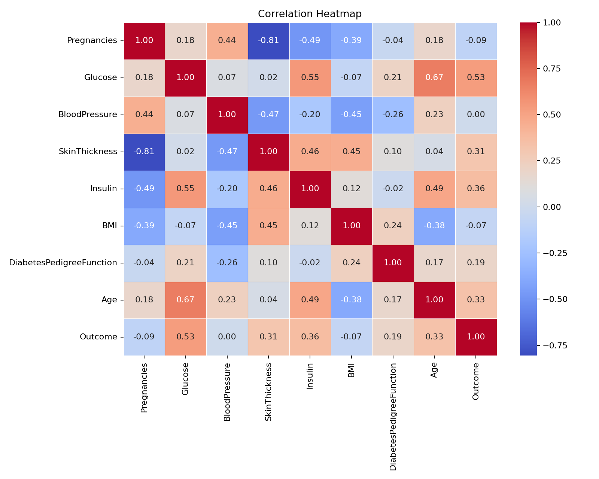
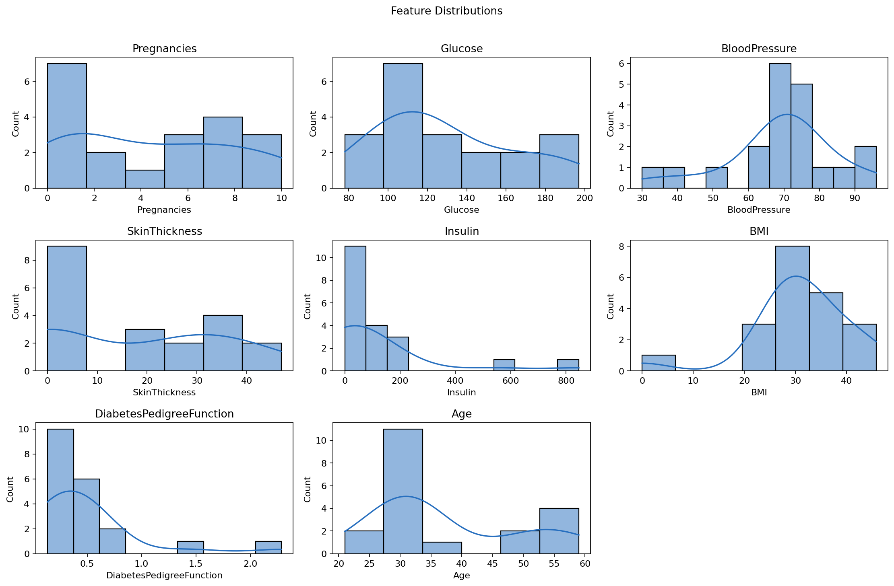
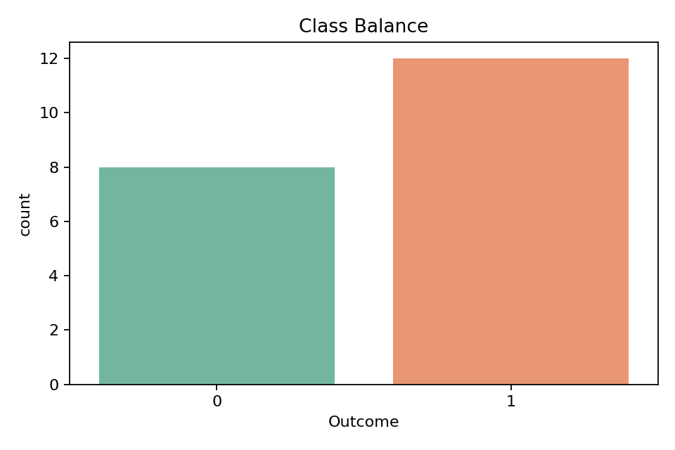

# Disease Prediction Model

ML classification project using Python, pandas, scikit-learn, matplotlib, and seaborn.

This project now includes a static HTML/CSS dashboard. Open `index.html` to view the project roadmap, status, generated chart slots, and latest metrics after a pipeline run.

## Project Status

| Done | Building | To Do |
| --- | --- | --- |
| Dataset loading from CSV | Model training | Flask or Streamlit UI |
| Data cleaning pipeline | Accuracy tuning | Deploy on Hugging Face |
| EDA notebook and chart export | Model comparison | Add richer feature selection |

## Roadmap

| Time | Focus | Deliverable |
| --- | --- | --- |
| 9am - 12pm | Data cleaning Python | Handle missing values, fix zero-value anomalies in glucose and BP columns, check data types. |
| 12pm - 3pm | EDA visualizations Python | Correlation heatmap, distribution plots, class balance check. Save charts as images for README. |
| 3pm - 4pm | Break | Walk. Hydrate. |
| 4pm - 7pm | Feature engineering ML | StandardScaler normalization, train/test split 80/20, prepare X and y. |
| 7pm - 10pm | First model run ML | Train Logistic Regression and Random Forest. Print accuracy and confusion matrix. |

## Folder Structure

```text
disease-prediction-model/
  data/
    raw/                 # Put your source CSV here
    processed/           # Cleaned dataset output
  models/                # Saved models and scaler artifacts
  reports/
    figures/             # README-ready PNG charts
  assets/
    css/styles.css
    js/app.js
  index.html             # Static dashboard
  notebooks/
    01_eda.ipynb
  src/
    data_cleaning.py
    eda_visualizations.py
    feature_engineering.py
    train_models.py
    run_pipeline.py
```

## Expected Dataset

Place your CSV at:

```bash
data/raw/diabetes.csv
```

A small demo file is included at:

```bash
data/raw/sample_diabetes.csv
```

The pipeline expects a classification target column named one of:

- `Outcome`
- `target`
- `label`
- `class`
- `diagnosis`

For zero-value anomaly fixing, it recognizes glucose and blood pressure columns named like:

- `Glucose`, `glucose`
- `BloodPressure`, `Blood_Pressure`, `BP`, `blood_pressure`

Zeros in glucose and blood pressure are treated as invalid medical measurements and replaced with missing values before median imputation.

## Setup

```bash
python -m venv .venv
.venv\Scripts\activate
pip install -r requirements.txt
```

Install the requirements before running the pipeline. The plotting and model scripts depend on `matplotlib`, `seaborn`, and `scikit-learn`.

## Run The Full Pipeline

```bash
python src/run_pipeline.py --input data/raw/diabetes.csv
```

Demo run:

```bash
python src/run_pipeline.py --input data/raw/sample_diabetes.csv
```

## View The Dashboard

Open this file in your browser:

```text
index.html
```

For live metrics loading from `reports/metrics.json`, serve the folder locally:

```bash
python -m http.server 8000
```

Then open:

```text
http://localhost:8000
```

## Run Steps Individually

```bash
python src/data_cleaning.py --input data/raw/diabetes.csv --output data/processed/cleaned_diabetes.csv
python src/eda_visualizations.py --input data/processed/cleaned_diabetes.csv
python src/feature_engineering.py --input data/processed/cleaned_diabetes.csv
python src/train_models.py
```

## Generated Outputs

After running, these files are created:

- `data/processed/cleaned_diabetes.csv`
- `reports/figures/correlation_heatmap.png`
- `reports/figures/distribution_plots.png`
- `reports/figures/class_balance.png`
- `models/train_test_data.joblib`
- `models/logistic_regression.joblib`
- `models/random_forest.joblib`
- `reports/metrics.json`

## README Charts

Add generated figures here after the first run:

```md



```
